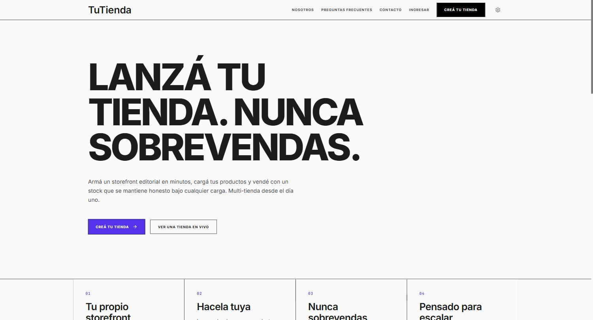
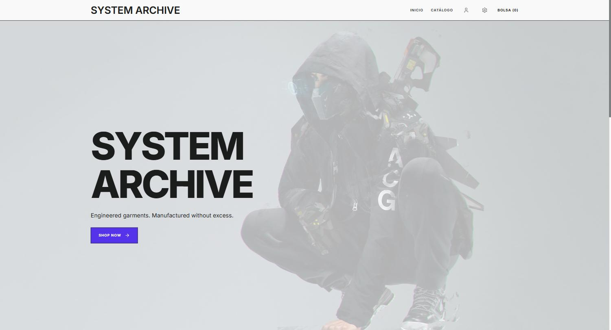
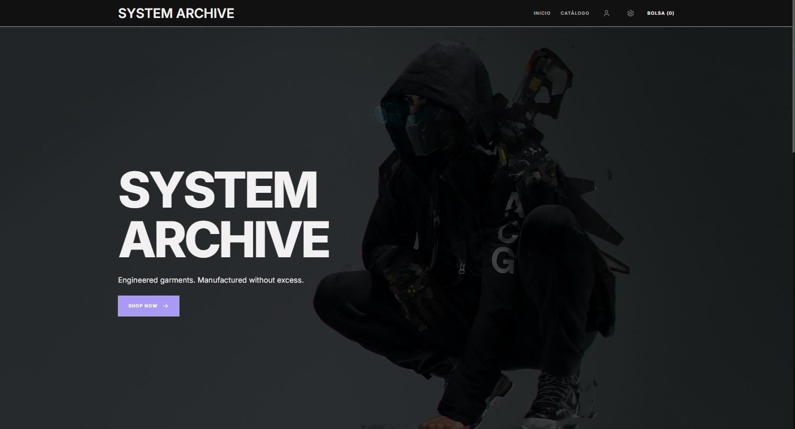
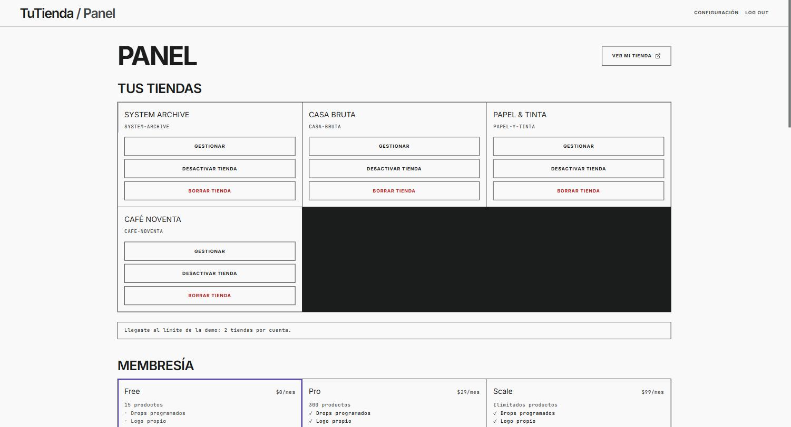
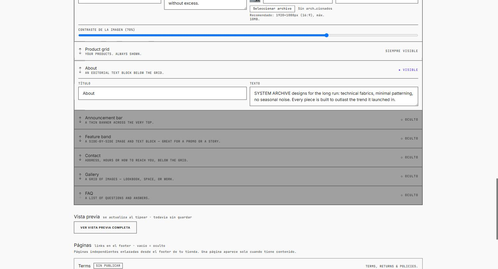
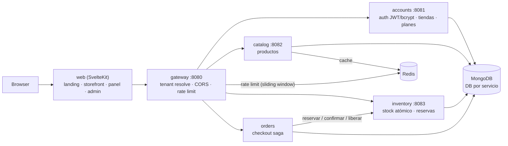

# TuTienda

> **SaaS de ecommerce multi-tienda** (al estilo Tienda Nube / Shopify) construido alrededor de un
> problema difícil: **nunca sobrevender stock bajo carga concurrente**, con la garantía **aislada
> por tienda**. Cada comerciante se registra, arma su propio storefront y carga sus propios
> productos — 5 microservicios en Go, un frontend en SvelteKit y una garantía de inventario que se
> puede verificar con un test, no solo prometer.

[](https://tutienda.mateopavoni.com.ar/)
 · 

Stack: **Go · SvelteKit 5 · MongoDB · Redis · Docker**

### 🔗 Demo en vivo

**[tutienda.mateopavoni.com.ar](https://tutienda.mateopavoni.com.ar/)** — recorré una tienda ya
cargada en [`/store/system-archive`](https://tutienda.mateopavoni.com.ar/store/system-archive) o
creá la tuya propia en [`/signup`](https://tutienda.mateopavoni.com.ar/signup) (onboarding real,
sin verificación de email — es una demo). También podés entrar directo al panel del comerciante
con una cuenta de prueba ya cargada con 4 tiendas de ejemplo:

```
https://tutienda.mateopavoni.com.ar/login
demo@system-archive.store / demo-archive-2026
```

Deployado en una VPS propia: el gateway y el storefront corren en **Dokku** (TLS), el resto de los
servicios en `docker compose` en la misma VPS. Deploy automático en cada push a `main`
(`.github/workflows/deploy.yml`).

### Capturas

| Landing (marketing) | Tienda de ejemplo (claro) |
|---|---|
|  |  |

| Tienda de ejemplo (oscuro) | Panel del comerciante — sus tiendas |
|---|---|
|  |  |

**Editor de storefront con vista previa en vivo** — el comerciante arma secciones (hero, galería,
FAQ, contacto...) y ve el resultado antes de guardar, sin round-trip al backend:


---

## ¿Qué resuelve?

Cuando mil compradores compiten por las últimas diez unidades, una tienda ingenua vende doce.
**TuTienda** sostiene la línea: el stock se mueve por operaciones atómicas y guardadas en MongoDB,
así que el disponible nunca queda negativo y entran exactamente las unidades que hay — el resto
recibe un "sin stock" limpio. Los carritos tienen una reserva real y con expiración; el stock de un
carrito abandonado vuelve solo.

**No es un CRUD con formularios.** El valor está en tres piezas de ingeniería real:

1. **No-oversell verificable, no prometido** — la garantía sale de una operación atómica de Mongo
   (`findOneAndUpdate` con guard `$gte`) y está probada con el race detector de Go y un load test
   que dispara cientos de compradores concurrentes contra un SKU escaso. Aislada **por tienda**: la
   carga de una nunca toca el stock de otra.
2. **Multi-tenancy real, no cosmético** — un mismo `tenantId` atraviesa los 5 servicios y cada
   colección; el gateway resuelve el tenant desde el slug (o el JWT scopeado a la tienda) e
   inyecta el header aguas abajo, con anti-spoof explícito. Membresías (free/pro/scale) como
   **entitlements firmados** en el token, nunca un chequeo suelto del lado del cliente.
3. **Checkout como saga con compensación** — reservar → persistir → confirmar; si algo falla en el
   medio, se libera la reserva (acción compensatoria) y la orden queda en `FAILED`, nunca en un
   estado intermedio. Sin orquestador externo.

### Features

- **No oversell bajo carga**, aislado por tenant — reservas atómicas por SKU; load test con
  cientos de compradores concurrentes, cero oversell verificable.
- **Reservas con expiración compensada** — un janitor (goroutine) devuelve el stock de las
  reservas vencidas antes de borrarlas; un TTL index solo borraría el documento y filtraría stock.
- **Checkout saga** con compensación automática ante fallo de pago o de confirmación.
- **Precios server-authoritative** — el total se calcula contra el catálogo, nunca se confía en lo
  que manda el cliente.
- **Multi-tenant SaaS de punta a punta** — landing de marketing en `/`, onboarding de comerciante
  (`/signup` crea la cuenta y la primera tienda), storefront por tienda en `/store/[slug]`, panel
  del comerciante en `/app`.
- **Membresías como entitlements firmados** — planes free/pro/scale gatean drops temporizados,
  secciones extra del storefront y límite de productos, verificado del lado del servidor.
- **Editor de storefront** — el comerciante reordena/oculta secciones, edita copy e imágenes, con
  vista previa en vivo (client-side, sin guardar) antes de publicar.
- **Drops temporizados** — un producto puede salir a la venta en un instante programado; cuenta
  regresiva + stock en vivo en el storefront, y la compra se bloquea **del lado del servidor**
  (no solo oculta en la UI) hasta que el drop abre.
- **Consola super-admin** — rol separado (`/admin`) con visibilidad cross-tenant: stats,
  todas las tiendas, todos los comerciantes, override de plan — gateado por un claim de rol
  firmado, no una ruta escondida.
- **Auth propia** — JWT HS256 hecho a mano con la stdlib + bcrypt, dos scopes de token (comerciante
  y por-tienda), sin dependencia de un framework de auth.
- **Gateway** — punto de entrada único con reverse proxy, resolución de tenant, CORS y rate
  limiting distribuido (sliding window sobre Redis).
- **Storefront editorial** — sistema de diseño monocromo con acento por tienda (con guarda de
  contraste automática), tema claro/oscuro, en inglés, español y portugués de Brasil.

### En números

**27 tests Go** (con `-race`) **+ 22 tests Vitest** · load test de concurrencia real (500
compradores contra un SKU de 10 unidades, 0 oversell) · deploy en producción con CI/CD propio
(push a `main` → `go test -race` → deploy completo) · 5 servicios Go compartiendo un módulo y un
paquete `platform` común.

---

## Arquitectura (resumen)

Monorepo de 2 componentes. El detalle —modelo de dominio, contrato de API, algoritmo de reservas y
decisiones técnicas— está en **[`ARCHITECTURE.md`](./ARCHITECTURE.md)**.



```
tutienda/
├── services/                 Go module, un binario por servicio
│   ├── cmd/{gateway,accounts,catalog,inventory,orders,loadtest}/
│   └── internal/
│       ├── platform/         config, mongo, redis, http + tenant + authx (JWT/bcrypt) + plan
│       ├── accounts/         auth de comerciante + registro de tiendas (tenant) + planes
│       ├── catalog/          productos + cache Redis (por tenant)
│       ├── inventory/        stock atómico, reservas, janitor (núcleo de concurrencia, por tenant)
│       └── orders/           saga de checkout
├── web/                       SvelteKit: landing + storefront por tienda + panel + super-admin
├── docker-compose.yml
└── ARCHITECTURE.md
```

---

## Cómo correr

### Opción A — Docker (todo junto, recomendado)

Go no hace falta instalarlo local: todo se buildea en contenedores.

```bash
cp .env.example .env
docker compose up --build
```

- Landing: http://localhost:3000
- Tienda demo: http://localhost:3000/store/system-archive
- Panel del comerciante: http://localhost:3000/app (`/login` o creá una tienda en `/signup`)
- Gateway: http://localhost:8080

```bash
curl http://localhost:8080/health                            # health agregada de los 5 servicios
curl -H "X-Tenant-Slug: system-archive" \
  http://localhost:8080/api/catalog/products                 # catálogo de la tienda demo
```

El catálogo y el stock se siembran solos en el primer arranque.

### Opción B — Solo frontend (dev)

```bash
cd web && npm install && npm run dev      # http://localhost:5173, apunta al gateway público
```

---

## La demo de concurrencia

```bash
docker compose run --rm loadtest
```

Cientos de compradores compiten por un SKU con 10 unidades. El load test resetea el stock a los
valores de seed antes de correr, así que el resultado es el mismo en cada corrida:

```
Target SKU AX1-85 — starting available: 10
Firing 500 buyers (max 150 in flight)...

Results
-------
  confirmed orders : 10
  out of stock     : 490
  other failures   : 0
  stock available  : 10 -> 0

OK: sold exactly 10 of 10 units, zero oversell.
```

---

## Tests

```bash
docker compose run --rm backend-test      # Go, con el race detector
cd web && npm install && npm test         # Vitest
```

La suite de inventario cubre la garantía central (no-oversell con cientos de goroutines
concurrentes), las transiciones confirm/release, compensación multi-SKU y expiración por el
janitor — además de aislamiento entre tiendas.

---

## Performance

Lighthouse contra la demo en vivo (mobile, throttling simulado — configuración por defecto de
PageSpeed Insights), 2026-07-20:

| Página | Performance | Accessibility | Best Practices | SEO |
|---|---|---|---|---|
| `/` (landing) | 90 | 98 | 100 | 100 |
| `/store/system-archive` (storefront) | 67 | 100 | 100 | 92 |

El storefront pierde puntos por el TTFB del root document (~820ms) — una sola VPS sin CDN ni
edge cache delante, coherente con el resto de las limitaciones de infra de abajo. Reproducir:

```bash
npx lighthouse https://tutienda.mateopavoni.com.ar/store/system-archive \
  --only-categories=performance,accessibility,best-practices,seo
```

---

## Limitaciones conocidas

- El pago es simulado: el checkout expone un toggle aprobar/rechazar, no hay gateway real
  integrado (documentado a propósito, es un proyecto de portfolio).
- Las llamadas entre servicios son HTTP síncrono — un outbox orientado a eventos es el paso
  natural siguiente si esto tuviera que escalar de verdad.
- Una sola instancia de MongoDB, una base lógica por servicio (sin aislamiento físico).
- Las tiendas comparten colecciones, aisladas por `tenantId` (modelo Shopify/Tienda Nube), no
  físicamente.
- Sin CDN/edge cache delante de la VPS — el TTFB del storefront (~820ms) es el mayor lastre de
  performance hoy (ver sección Performance).

---

## Licencia

© 2026 Mateo Pavoni. Todos los derechos reservados. Software propietario, publicado solo con fines
de evaluación/portfolio. Prohibida su copia, redistribución o reuso sin autorización escrita. Ver
[LICENSE](./LICENSE).
